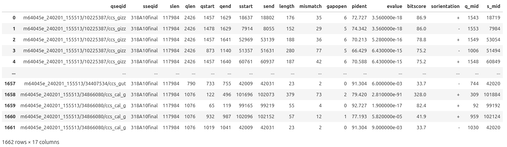
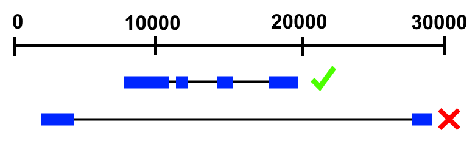
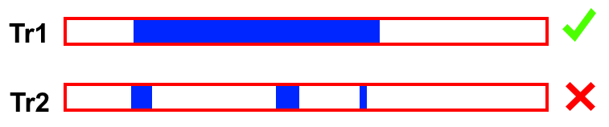
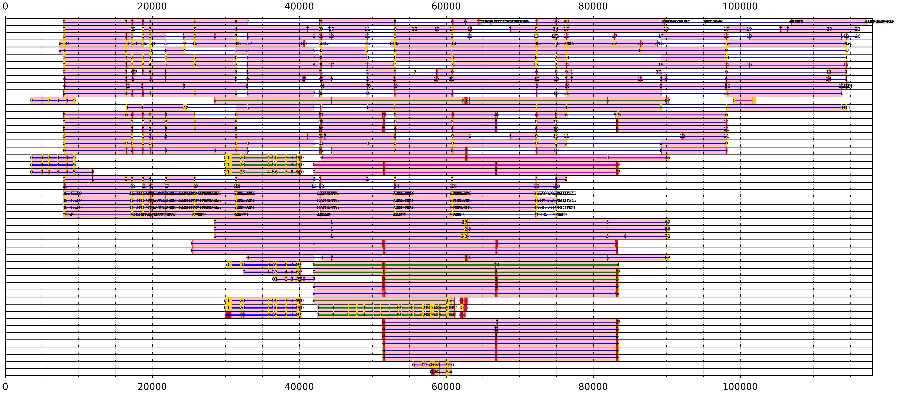

# Worked example

This guide will walk through the main Jupyter-Notebook of the software - lrRNAseq_TAST_visualiser.ipynb, cell-by-cell, explaining in detail, how to use each cell, what is being done, and the data structures generated in the process. 

For best experience, Linux-based operating systems are advised; this guide will assume you have a Linux-based operating system. This is mostly important when using BLAST.

*= work in progress.

## Step 1 - Download lrRNAseq-TAST

Download the entire lrRNAseq-TAST repository. This can be done by clicking on the green "<> Code" drop down menu button on the main page of lrRNAseq-TAST repository, then clicking "Download ZIP", and extracting the ZIP into the directory of choice.

An alternative method is to use git:
```
git clone https://github.com/Maxim-Karpov/lrRNAseq-TAST.git
```

## Step 2 - Install Anaconda Python distribution

For novice users it is recommended to install Anaconda distribution platform which contains Python, Jupyter-Notebook, and some required Python libraries such as Pandas and Matplotlib, and adds Python to your shell environment. Follow the instructions on the official Anaconda website - https://www.anaconda.com/download. 

Once installed, open Jupyter-Notebook through Anaconda Navigator and launch lrRNAseq-TAST by opening lrRNAseq_TAST_visualiser.ipynb. The full list of dependencies includes: Pandas, Matplotlib, Numpy, Regex, Biopython, OS, ast, operator. With Anaconda, you should only need to manually install biopython and seqtk:
```
conda install anaconda::biopython
conda install bioconda::seqtk
```

## Step 3 - Check all imports

To check whether all dependencies are present in your Python environment, and the supplementary functions can be imported successfully, run the first cell of the notebook. The bioinformatic_functions.ipynb must be in the same directory as lrRNAseq_TAST_visualiser.ipynb for this to work. In case some dependencies are missing, consult the internet on their installation.

```
import pandas as pd
import numpy as np
import matplotlib.pyplot as plt
import re
import os
import matplotlib.patches as patches
import matplotlib
from Bio import SeqIO
from matplotlib.ticker import MaxNLocator
from ast import literal_eval
from operator import itemgetter
import warnings
warnings.filterwarnings("ignore")
%run "./bioinformatic_functions.ipynb"
```

## Step 4 - Align long read RNAseq transcripts to a genomic region

Install BLAST in your shell environment:

```
conda install bioconda::blast
```

Make BLAST database of your genomic sequence. Here we're using Ef318A10.fst (provided in the repository), which is a Bacterial Artificial Chromosome sequence of a genomic locus containing an earthworm metallothionein gene, about 100 kb in length. In your shell environment, whilst in the directory containing Ef318A10.fst genomic sequence, run:

```
makeblastdb -in Ef318A10.fst -dbtype nucl -parse_seqids -out 318A10_db -title 318A10_db
```

Align long read RNAseq transcripts to a genomic region using BLAST with alignment parameters of your choice. Example transcript file "all_transcripts.fasta" was supplied in the lrRNAseq-TAST repository.

```
blastn -query /home/maxim/Projects/BACs/publication/lrRNAseq_TAST/all_transcripts.fasta -db 318A10_db -max_hsps 10000 -task blastn -word_size 4 -evalue 10 -num_threads 10 -out lrRNAseq_to_Ef318A10.out -outfmt '6 qseqid sseqid slen qlen qstart qend sstart send length mismatch gapopen pident evalue bitscore'
```

Important: lrRNAseq-TAST assumes you will use -outfmt '6 qseqid sseqid slen qlen qstart qend sstart send length mismatch gapopen pident evalue bitscore' BLAST output format. 


-word_size 4, -evalue 10 will yield highest sensitivity, and will detect very short exons, but may take unreasonably long to run, and produce many false positives. If such sensitivity is really desired, it is recommended to run BLAST for some managable period of time (e.g. 10 minutes), and interrupt the command; this should still work given your transcripts of interest in your lrRNAseq dataset are not rare / poorly expressed / of low abundance. Note: evalue parameter affect BLAST running time but does affect memory usage (in our use cases, negligibly). 

-word_size 8, may be managable to run to the end.

-word_size 12+, may be used for exploratory purposes, to find the transcripts whose exons are long and invariable between individuals/species, thereby aligning well. These transcripts can then be extracted and re-BLASTed with higher sensitivity (lower word_size) to obtain more accurate intron-exon junctions.

It is recommended to run high e-value (10) in all cases, then perform e-value filtering inside the jupyter-notebook (feature coming soon).

## Step 5 - Import BLAST alignments to your notebook

In the following notebook cell, provide path to your BLAST output. For example:

```
TRANSCRIPT_TO_GENOME_BLAST_PATH = "/home/maxim/Projects/BACs/publication/lrRNAseq_TAST/lrRNAseq_to_Ef318A10.out"
all_blast = read_blast(TRANSCRIPT_TO_GENOME_BLAST_PATH)
```

Then run the cell. This parses the BLAST output to a Pandas dataframe using the read_blast() function. The all_blast dataframe contains the BLAST output with some additional columns - sorientation (orientation of subject), q_mid (alignment midpoint on query), s_mid (alignment midpoint on subject).



## Step 6 - Calculate transcript filtration variables

In this step, for each transcript, maximal distance between two alignment regions (maximal intron gap), and transcript coverage (how much of the transcript was covered by all of its alignments to genome), will be calculated for future filtering purposes. Run the cell.

```
grouped_blast = all_blast.groupby("qseqid")

all_blast["Tr_coverage"] = 0
cov_dict = {}
dist_dict = {}
for tr, temp_df in grouped_blast:
    qlen = temp_df["qlen"].max()
    temp_df = temp_df.sort_values(by="qstart").reset_index(drop=True)
    q_overlaps, q_cov = calc_overlaps(temp_df, "q") 
    q_overlaps["Length"] = q_overlaps["Right"] - q_overlaps["Left"] 
    coverage = 100 / qlen * q_overlaps["Length"].sum()  
    cov_dict[tr] = coverage

    temp_df = temp_df.sort_values(by="sstart").reset_index(drop=True)
    q_overlaps, q_cov = calc_overlaps(temp_df, "s") 
    right = q_overlaps["Right"].tolist()
    left = q_overlaps["Left"].tolist()
    distances = []
    if len(right)>1:
        for i in range(len(right)-1):
            distances.append(left[i+1]-right[i])
    else:
        distances = [0]
    dist_dict[tr] = distances

# all_blast.loc[all_blast["qseqid"] == tr, "Tr_coverage"] = coverage
all_blast["Tr_coverage"] = all_blast["qseqid"].apply(lambda x: cov_dict[x])
all_blast["s_distances"] = all_blast["qseqid"].apply(lambda x: dist_dict[x])
all_blast["max_distance"] = all_blast["s_distances"].apply(lambda x: max(x))
all_blast["srange"] = all_blast.apply(lambda x: [x.sstart, x.send], axis = 1)
all_blast["qrange"] = all_blast.apply(lambda x: [x.qstart, x.qend], axis = 1)
all_blast["counts"] = all_blast.groupby("qseqid")["sseqid"].transform("count")
```

## Step 7 - Sort dataframe by subject start

Self explanatory, performed for the sake of further processing. Run the cell.

```
cov50=all_blast.sort_values("sstart").reset_index(drop=True)
```

## Step 8 - Filter by maximal intron length and minimal transcript coverage

In this example, if the space between two neighbouring alignments exceeds 20000 bp, the transcript will be filtered out. Run the cell.

```
MAX_INTRON_LENGTH = 20000
cov50 = cov50[cov50["max_distance"]<MAX_INTRON_LENGTH]
```



Furthermore, if the transcript is insufficiently covered by alignments (in this example, if less than 25%), it is filtered out. Program accounts for alignments that overlap. Run the cell.

```
MIN_COVERAGE = 25
cov50 = cov50[cov50["Tr_coverage"]>MIN_COVERAGE]
```



This step significantly reduces the number of false positives. Feel free to tweak MIN_INTRON_LENGTH and MIN_COVERAGE variables, based on your knowledge of organism biology.

Lastly, save the list of the transcript IDs remaining after filtration for further processing. Specify the save path in the FILTERED_TRANCRIPT_IDS variable.

```
FILTERED_TRANCRIPT_IDS = "./aligned_lrRNAseq_cov25_filtered.txt"
write_list(cov50.drop_duplicates("qseqid")["qseqid"].tolist(), FILTERED_TRANCRIPT_IDS)
```

## Step 9 - Extract the transcripts that passed the filtration and import into the notebook

Step produces a FASTA file including only the transcripts that passed the filtration procedure. Seqtk subseq extracts transcripts by transcript ID from the main lrRNAseq fasta. Enter path to the initial lrRNAseq file into the ALL_TRANSCRIPTS_PATH variable and the name of the fasta file that will contain post-filtered transcripts into the FILTERED_TRANSCRIPTS_FASTA_PATH variable. Run the cell.

```
ALL_TRANSCRIPTS_PATH = "./all_transcripts.fasta"
FILTERED_TRANSCRIPTS_FASTA_PATH = "filtered_transcripts.fasta"
os.system(f"seqtk subseq {ALL_TRANSCRIPTS_PATH} {FILTERED_TRANSCRIPT_IDS} > {FILTERED_TRANSCRIPTS_PATH}")
```

Import these transcripts into the notebook environment. If your transcripts still contain barcode sequences at either end (the example data contains barcodes of length 39 bp at either end), you need to remove the barcodes by specifying their length into the BARCODE_LEN variable. The program then imports these transcripts and calclates various statistics (find_tr_ORF_stats() function). Run the cell.

```
BACRODE_LEN = 39
cov50_fasta = parse_fasta(FILTERED_TRANSCRIPT_FASTA_PATH,rm_barcode=BARCODE_LEN)[0]
all_stats = find_tr_ORF_stats(cov50_fasta["seq"].tolist(),cov50_fasta["id"].tolist(),tissue=True, include_seq=True)
```

The resulting dataframe "all_stats" is large and contains information about polyA length/position, properties of the sequence (e.g. GC%, number of stop codons, Open Reading Frame coordinates, coding sequence, translated protein sequences from the ORFs etc.). If you would like to view the dataframe, disable the display limit for columns in Pandas by running:

```
pd.set_option('display.max_columns', None)
```

Then run the cell with just the dataframe name.

## Step 10 - Import FASTA of the genomic region of interest

Set path to the genomic sequence in the GENOME_FASTA_PATH variable. Run the cell.

```
GENOME_FASTA_PATH = "./Ef318A10.fst"
my_seq = "".join([line.strip() for line in open(GENOME_FASTA_PATH) if not line.startswith(">")])
seq_len = len(my_seq)
```

## Step 11 - Calculate further ORF statistics*

In this step, the program calculates other various ORF statistics, combining the BLAST alignments with the predicted ORFs in the transcript sequences. In essence, the program determines which alignment regions on query fall in range of transcript's ORFs/largest ORF. The alignments falling into any ORF will be coloured in red, whilst the ones falling into the largest ORF, will be yellow on the final plot. This step may take a few minutes, run the cell.

```
#calculate ORF overlap statistics
all_s = all_stats[["id", "ORF_coords", "all_ORF_coords", "ORF_lengths", "num_ORFs_found"]]
all_s.rename(columns={"id":"qseqid"}, inplace=True)

cov50_ranges = cov50.groupby("qseqid").agg({"srange": "sum", "qrange": "sum"})
cov50_ranges = cov50_ranges.reset_index()

cov50_ranges["start"] = cov50_ranges["srange"].apply(lambda x: min(x))
cov50_ranges["end"] = cov50_ranges["srange"].apply(lambda x: max(x))

cov50_ranges["qstarts"] = cov50_ranges["qrange"].apply(lambda x: x[::2])
cov50_ranges["TrRange"] = cov50_ranges.apply(lambda x: [x["start"], x["end"]], axis=1)
cov50_ranges["TrLen"] = cov50_ranges["end"] - cov50_ranges["start"]

cov50_ranges = cov50_ranges.merge(right=all_s, on="qseqid",how="inner")
cov50_ranges["left_ORF_coords"] = cov50_ranges["all_ORF_coords"].apply(lambda x: [i[0] for i in x])
cov50_ranges["right_ORF_coords"] = cov50_ranges["all_ORF_coords"].apply(lambda x: [i[1] for i in x])

cov50_ranges["overlap_ORF_coords"] = cov50_ranges.apply(lambda x: calc_overlaps(pd.DataFrame({"Left":x.left_ORF_coords,"Right":x.right_ORF_coords}),by="LeftRight")[0]["Coords"].tolist(), axis=1)

cov50_ranges["qranges"] = cov50_ranges["qrange"].apply(lambda x: [[[x[::2], x[1::2]][0][i], [x[::2], x[1::2]][1][i]] for i in range(len([x[::2], x[1::2]][0]))])

cov50_ranges["in_ORF_matrix"] = cov50_ranges.apply(lambda x: [bool(list(pd.RangeIndex(i[0],i[1]).intersection(pd.RangeIndex(b[0],b[1])))) for i in x.qranges for b in x.overlap_ORF_coords], axis=1)
cov50_ranges["in_ORF_matrix_largest"] = cov50_ranges.apply(lambda x: [bool(list(pd.RangeIndex(i[0],i[1]).intersection(pd.RangeIndex(b[0],b[1])))) for i in x.qranges for b in [x.ORF_coords]], axis=1)

cov50_ranges["qranges_in_ORF"] = cov50_ranges.apply(lambda x: [any(z) for z in [[bool(list(pd.RangeIndex(i[0],i[1]).intersection(pd.RangeIndex(b[0],b[1])))) for i in x.qranges for b in x.overlap_ORF_coords][v:v+len(x.overlap_ORF_coords)] for v in range(0,len(x.in_ORF_matrix),len(x.overlap_ORF_coords))]], axis=1)
cov50_ranges["qranges_in_largest_ORF"] = cov50_ranges.apply(lambda x: [any(z) for z in [[bool(list(pd.RangeIndex(i[0],i[1]).intersection(pd.RangeIndex(b[0],b[1])))) for i in x.qranges for b in [x.ORF_coords]][v:v+len([x.ORF_coords])] for v in range(0,len(x.in_ORF_matrix_largest),len([x.ORF_coords]))]], axis=1)

cov50_ranges["qstarts_sorted_values"] = cov50_ranges["qstarts"].apply(lambda x: sort_with_order(x, make_equal=False)[0])
cov50_ranges["qstarts_sorted_order"] = cov50_ranges["qstarts"].apply(lambda x: sort_with_order(x, make_equal=False)[1])
cov50_ranges["qstarts_sorted_order_sequential"] = cov50_ranges["qstarts"].apply(lambda x: sort_with_order(x, make_sequential=True)[1])#true order of duplicate is lost
```

## Step 12 - Initialisation of transcript plotting

Transcript plotting algorithm revolves around maximising the space occupied by transcripts on each plotting track i.e. how to most optimally pack the transcripts into each row of a plot, to occupy maximal amount of space on the track, and minimize the number of tracks needed to plot all the transcripts. In other words, all transcripts cannot be fit into a single lane as they have overlapping ranges. Which combination of transcripts should be plotted first, before creating a separate lane for the rest of the transcripts? Here, the program determines, for each transcript, which other transcripts it overlaps with, and for which transcript pairs there is no overlap. Run the cell.

```
cov50_ranges_ = cov50_ranges.sort_values(by="start").reset_index(drop=True)
cov50_ranges_["TrOverlaps"] = ""
cov50_ranges_["TrSeparate"] = ""

for ii, ri in cov50_ranges_.iterrows():
    overlaps_with = []
    start = cov50_ranges_["start"][ii]
    end = cov50_ranges_["end"][ii]
    for ij, rj in cov50_ranges_.iterrows():
        if (end > cov50_ranges_["start"][ij] and end > cov50_ranges_["end"][ij] and start > cov50_ranges_["start"][ij] and start > cov50_ranges_["end"][ij]) or (end < cov50_ranges_["start"][ij] and end < cov50_ranges_["end"][ij] and start < cov50_ranges_["start"][ij] and start < cov50_ranges_["end"][ij]):
            overlaps_with.append(cov50_ranges_["qseqid"][ij])
    overlaps_with_ = [x for x in cov50_ranges_["qseqid"].tolist() if x not in overlaps_with]
    overlaps_with_ = [x for x in overlaps_with_ if x not in [cov50_ranges_["qseqid"][ii]]]
    cov50_ranges_["TrOverlaps"][ii] = overlaps_with_
    cov50_ranges_["TrSeparate"][ii] = overlaps_with
```

Following on, a minor calculation of number of overlapping and non overlapping transcripts. Run the cell.

```
cov50_ranges_["OverlapNum"] = cov50_ranges_["TrOverlaps"].apply(lambda x: len(x))
cov50_ranges_["SeparateNum"] = cov50_ranges_["TrSeparate"].apply(lambda x: len(x))
```

Next cell creates a backup copy of the dataframe, in case the user wants to re-run the steps ahead. The dataframe will irreversably mutate in the future steps, so backup is useful. Run the cell and the next one ahead.

```
cov50_ranges_bu = cov50_ranges_.copy()
```

```
cov50_ranges_ =  cov50_ranges_bu.copy()
cov50_ranges_["NumExon"] = cov50_ranges_["srange"].apply(lambda x: len(x)/2)
cov50_ranges_["index"] = cov50_ranges_.index
```

## Step 13 - Algorithm for establishing transcript arrangement on plotting tracks*

You have a single variable to specify - BATCH_SIZE, which determines the number of transcripts the program will attempt to optimally plot at once. Beware that BATCH_SIZE scales exponentially with time, but higher BATCH_SIZE will produce more compact plot. After plotting each track, it must recalculate overlapping/non-overlapping transcripts. The details of the algorithm will be verbalised and visualised in future versions of the documentation.

```
BATCH_SIZE = 40 
lrRNAseq_plot_df = pd.DataFrame()
cov50_ranges_bu = pd.DataFrame()

ranges = []
for iii in range(0,cov50.drop_duplicates("qseqid").shape[0],BATCH_SIZE):
    ranges.append(iii)
ranges.append(cov50.drop_duplicates("qseqid").shape[0])

for iii in range(len(ranges)-1):
    print(iii)
    cov50_ranges_ = cov50_ranges.sort_values(by="start").reset_index(drop=True)[ranges[iii]:ranges[iii+1]]
    cov50_ranges_["TrOverlaps"] = ""
    cov50_ranges_["TrSeparate"] = ""
    
    for ii, ri in cov50_ranges_.iterrows():
        overlaps_with = []
        start = cov50_ranges_["start"][ii]
        end = cov50_ranges_["end"][ii]
        for ij, rj in cov50_ranges_.iterrows():
            if (end > cov50_ranges_["start"][ij] and end > cov50_ranges_["end"][ij] and start > cov50_ranges_["start"][ij] and start > cov50_ranges_["end"][ij]) or (end < cov50_ranges_["start"][ij] and end < cov50_ranges_["end"][ij] and start < cov50_ranges_["start"][ij] and start < cov50_ranges_["end"][ij]):
                overlaps_with.append(cov50_ranges_["qseqid"][ij])
        overlaps_with_ = [x for x in cov50_ranges_["qseqid"].tolist() if x not in overlaps_with]
        #overlaps_with_ = list(set(cov50_ranges_["qseqid"].tolist())-set(overlaps_with))
        overlaps_with_ = [x for x in overlaps_with_ if x not in [cov50_ranges_["qseqid"][ii]]]
        cov50_ranges_["TrOverlaps"][ii] = overlaps_with_
        cov50_ranges_["TrSeparate"][ii] = overlaps_with
    
    cov50_ranges_["OverlapNum"] = cov50_ranges_["TrOverlaps"].apply(lambda x: len(x))
    cov50_ranges_["SeparateNum"] = cov50_ranges_["TrSeparate"].apply(lambda x: len(x))
    
    if iii==0:
        cov50_ranges_bu = cov50_ranges_.copy()
    else:
        cov50_ranges_bu = pd.concat([cov50_ranges_bu, cov50_ranges_])
        cov50_ranges_bu = cov50_ranges_bu.reset_index(drop=True)
    
    cov50_ranges_["NumExon"] = cov50_ranges_["srange"].apply(lambda x: len(x)/2)
    cov50_ranges_["index"] = cov50_ranges_.index
    
    from operator import itemgetter
    
    def visit(TpM, chain, ii, chains,stop,chain_bu):
        for z in range(len(TpM)):        
            if stop == 0 and TpM[ii][z] == 1 and max(chain[:])<z:
                chain_bu = chain[:]
                chain.append(z)
                if sum(TpM[z]) > 0:
                    visit(TpM, chain, z, chains,stop,chain_bu)
                else:
                    chains.append(chain[:])
                    chain=chain_bu[:]
    
    
    #cov50_ranges_.sort_values(by="TrLen", ascending=False, inplace=True)
    cov50_ranges_.sort_values(by="TrLen", ascending=False)
    
    mut_cov50_ranges = cov50_ranges_.copy()
    TrsLeft = mut_cov50_ranges.index.tolist()
    
    final_coord_list = []
    final_coord_members = []
    final_coord_groups = []
    final_chain_members = []
    final_chain_ranges = []
    final_group_lengths = []
    saveTpM_list = []
    for idx, r in mut_cov50_ranges.iterrows():
        if idx in TrsLeft:
            TrPartners = mut_cov50_ranges[mut_cov50_ranges["index"] == idx]["TrSeparate"].values[0]
            #print(len(TrPartners))
            if len(TrPartners) > 0:
                TpM = [[0]*len(TrPartners) for _ in range(len(TrPartners))]
                for trp in TrPartners:
                    #print(trp)
                    TpPartners = mut_cov50_ranges[mut_cov50_ranges["qseqid"]==trp]["TrSeparate"].values[0]
                    TrTpPartners = [x for x in TrPartners if x in TpPartners]
                    # print(mut_cov50_ranges["qseqid"][idx])
                    # print("idx", idx)
                    # print(TrPartners)
                    # print(TpPartners)
                    # print(len(TpPartners))
                    # print(TrTpPartners)
                    # print(len(TrTpPartners))
                    for trtpp in TrTpPartners:
                        if TrPartners.index(trp)<TrPartners.index(trtpp):
                            TpM[TrPartners.index(trp)][TrPartners.index(trtpp)] = 1
    
                if len(TpM)>1:
                    saveTpM_list.append(TpM)
                if sum([x for i in TpM for x in i]) == 0:
                    
                    total_lengths = []
                    
                    for tr in TrPartners:
                        total_length = mut_cov50_ranges[mut_cov50_ranges["qseqid"] == tr]["TrLen"].tolist()[0]
                        total_lengths.append(total_length)
                    
                    index_max = max(range(len(total_lengths)), key=total_lengths.__getitem__)
                    
                    best_trs_df = pd.concat([mut_cov50_ranges[mut_cov50_ranges["index"] == idx], mut_cov50_ranges[mut_cov50_ranges["qseqid"] == TrPartners[index_max]]])
                    best_trs_df = best_trs_df.sort_values(by="start")
                    coord_list = best_trs_df["srange"].tolist()
                    coord_list_ = [x for l in coord_list for x in l]
                    coord_members = len(coord_list_)/2
                    coord_groups = best_trs_df["NumExon"].tolist()
                    
                    final_coord_list.append(coord_list_)
                    final_coord_members.append(coord_members)
                    final_chain_members.append(best_trs_df["qseqid"].tolist())
                    final_coord_groups.append(coord_groups)
                    final_chain_ranges.append(best_trs_df["TrRange"].tolist())
                    final_group_lengths.append(best_trs_df["TrLen"].sum())
                    
                    trs_to_remove = best_trs_df.index.tolist()
                    TrsLeft = [x for x in TrsLeft if x not in trs_to_remove]
                    
                    cov50_ranges_.drop(trs_to_remove, inplace=True)
                    
                    for ii, ri in cov50_ranges_.iterrows():
                        overlaps_with = []
                        start = cov50_ranges_["start"][ii]
                        end = cov50_ranges_["end"][ii]
                        for ij, rj in cov50_ranges_.iterrows():
                            if (end > cov50_ranges_["start"][ij] and end > cov50_ranges_["end"][ij] and start > cov50_ranges_["start"][ij] and start > cov50_ranges_["end"][ij]) or (end < cov50_ranges_["start"][ij] and end < cov50_ranges_["end"][ij] and start < cov50_ranges_["start"][ij] and start < cov50_ranges_["end"][ij]):
                                overlaps_with.append(cov50_ranges_["qseqid"][ij])
                        overlaps_with_ = [x for x in cov50_ranges_["qseqid"].tolist() if x not in overlaps_with]
                        #overlaps_with_ = list(set(cov50_ranges_["qseqid"].tolist())-set(overlaps_with))
                        overlaps_with_ = [x for x in overlaps_with_ if x not in [cov50_ranges_["qseqid"][ii]]]
                        cov50_ranges_["TrOverlaps"][ii] = overlaps_with_
                        cov50_ranges_["TrSeparate"][ii] = overlaps_with
                    
                    cov50_ranges_["OverlapNum"] = cov50_ranges_["TrOverlaps"].apply(lambda x: len(x))
                    cov50_ranges_["SeparateNum"] = cov50_ranges_["TrSeparate"].apply(lambda x: len(x))
                
                    mut_cov50_ranges = cov50_ranges_.copy()
                    
                else:
                    chains = []
                    stop = 0
                    for i in range(len(TpM)):
                        for j in range(len(TpM)):
                            if TpM[i][j] == 1 and stop==0:
                                chain = [i,j] #0,7
                                chain_bkup = chain[:]
                                chains.append(chain[:])
                                if sum(TpM[j]) > 0:
                                    visit(TpM, chain, j, chains, stop, chain_bkup)
                    
                    correction = []
                    for elem in chains:
                        if sum(TpM[elem[-1]])==0 and sum(TpM[elem[-2]])==0:
                            correction.append(elem)
                    
                    chains = [x for x in chains if x not in correction]
                    new_chains = []
                    for elem in chains:
                        if elem not in new_chains:
                            new_chains.append(elem)
                    chains = new_chains
                   # print(chains)
                    total_lengths = []
                    
                    for chain in chains:
                        total_length = 0
                        for i in chain:
                            total_length += mut_cov50_ranges[mut_cov50_ranges["qseqid"] == TrPartners[i]]["TrLen"].tolist()[0]
                        total_lengths.append(total_length)
                    #print(total_lengths)
                    index_max = max(range(len(total_lengths)), key=total_lengths.__getitem__)
                
                    best_chain = chains[index_max]
                
                    best_trs = itemgetter(*best_chain)(TrPartners)
                    #print("besttrs1", best_trs)
                    #print("idx", idx)
                    best_trs_df = pd.concat([mut_cov50_ranges[mut_cov50_ranges["index"] == idx], mut_cov50_ranges[mut_cov50_ranges["qseqid"].isin(best_trs)]])
                    #print("besttrs2", best_trs_df)
                    best_trs_df = best_trs_df.sort_values(by="start")
                    coord_list = best_trs_df["srange"].tolist()
                    coord_list_ = [x for l in coord_list for x in l]
                    coord_members = len(coord_list_)/2
                    coord_groups = best_trs_df["NumExon"].tolist()
                    
                    final_coord_list.append(coord_list_)
                    final_coord_members.append(coord_members)
                    final_chain_members.append(best_trs_df["qseqid"].tolist())
                    final_coord_groups.append(coord_groups)
                    final_chain_ranges.append(best_trs_df["TrRange"].tolist())
                    final_group_lengths.append(best_trs_df["TrLen"].sum())
                
                    trs_to_remove = best_trs_df.index.tolist()
                    TrsLeft = [x for x in TrsLeft if x not in trs_to_remove]
                    
                    cov50_ranges_.drop(trs_to_remove, inplace=True)
                    
                    for ii, ri in cov50_ranges_.iterrows():
                        overlaps_with = []
                        start = cov50_ranges_["start"][ii]
                        end = cov50_ranges_["end"][ii]
                        for ij, rj in cov50_ranges_.iterrows():
                            if (end > cov50_ranges_["start"][ij] and end > cov50_ranges_["end"][ij] and start > cov50_ranges_["start"][ij] and start > cov50_ranges_["end"][ij]) or (end < cov50_ranges_["start"][ij] and end < cov50_ranges_["end"][ij] and start < cov50_ranges_["start"][ij] and start < cov50_ranges_["end"][ij]):
                                overlaps_with.append(cov50_ranges_["qseqid"][ij])
                        overlaps_with_ = [x for x in cov50_ranges_["qseqid"].tolist() if x not in overlaps_with]
                        #overlaps_with_ = list(set(cov50_ranges_["qseqid"].tolist())-set(overlaps_with))
                        overlaps_with_ = [x for x in overlaps_with_ if x not in [cov50_ranges_["qseqid"][ii]]]
                        cov50_ranges_["TrOverlaps"][ii] = overlaps_with_
                        cov50_ranges_["TrSeparate"][ii] = overlaps_with
                    
                    cov50_ranges_["OverlapNum"] = cov50_ranges_["TrOverlaps"].apply(lambda x: len(x))
                    cov50_ranges_["SeparateNum"] = cov50_ranges_["TrSeparate"].apply(lambda x: len(x))
                
                    mut_cov50_ranges = cov50_ranges_.copy()
            else:
                coord_list_ = mut_cov50_ranges[mut_cov50_ranges["index"] == idx]["srange"].values[0]
                coord_members = len(coord_list_)/2            
                coord_groups = mut_cov50_ranges[mut_cov50_ranges["index"] == idx]["NumExon"].values[0]
                
                final_coord_list.append(coord_list_)
                final_coord_members.append(coord_members)
                final_chain_members.append(mut_cov50_ranges[mut_cov50_ranges["index"] == idx]["qseqid"].values[0])
                final_coord_groups.append(coord_groups)
                final_chain_ranges.append(mut_cov50_ranges[mut_cov50_ranges["index"] == idx]["TrRange"].values[0])
                final_group_lengths.append(mut_cov50_ranges[mut_cov50_ranges["index"] == idx]["TrLen"].values[0])
                
                trs_to_remove = [idx]
                TrsLeft = [x for x in TrsLeft if x not in trs_to_remove]
                
                cov50_ranges_.drop(trs_to_remove, inplace=True)
                
                for ii, ri in cov50_ranges_.iterrows():
                    overlaps_with = []
                    start = cov50_ranges_["start"][ii]
                    end = cov50_ranges_["end"][ii]
                    for ij, rj in cov50_ranges_.iterrows():
                        if (end > cov50_ranges_["start"][ij] and end > cov50_ranges_["end"][ij] and start > cov50_ranges_["start"][ij] and start > cov50_ranges_["end"][ij]) or (end < cov50_ranges_["start"][ij] and end < cov50_ranges_["end"][ij] and start < cov50_ranges_["start"][ij] and start < cov50_ranges_["end"][ij]):
                            overlaps_with.append(cov50_ranges_["qseqid"][ij])
                    overlaps_with_ = [x for x in cov50_ranges_["qseqid"].tolist() if x not in overlaps_with]
                    #overlaps_with_ = list(set(cov50_ranges_["qseqid"].tolist())-set(overlaps_with))
                    overlaps_with_ = [x for x in overlaps_with_ if x not in [cov50_ranges_["qseqid"][ii]]]
                    cov50_ranges_["TrOverlaps"][ii] = overlaps_with_
                    cov50_ranges_["TrSeparate"][ii] = overlaps_with
                
                cov50_ranges_["OverlapNum"] = cov50_ranges_["TrOverlaps"].apply(lambda x: len(x))
                cov50_ranges_["SeparateNum"] = cov50_ranges_["TrSeparate"].apply(lambda x: len(x))
            
                mut_cov50_ranges = cov50_ranges_.copy()
    
    for idx, row in mut_cov50_ranges.iterrows():
        coord_list_ = mut_cov50_ranges["srange"][idx]
        coord_members = len(coord_list_)/2            
        coord_groups = mut_cov50_ranges["NumExon"][idx]
        
        final_coord_list.append(coord_list_)
        final_coord_members.append(coord_members)
        final_chain_members.append(mut_cov50_ranges["qseqid"][idx])
        final_coord_groups.append(coord_groups)
        final_chain_ranges.append(mut_cov50_ranges["TrRange"][idx])
        final_group_lengths.append(mut_cov50_ranges["TrLen"][idx])
    
    lrRNAseq_plot_df_pre = pd.DataFrame()
    lrRNAseq_plot_df_pre["coords"] = final_coord_list
    lrRNAseq_plot_df_pre["total_exons"] = final_coord_members
    lrRNAseq_plot_df_pre["TrNames"] = final_chain_members
    lrRNAseq_plot_df_pre["exons_per_tr"] = final_coord_groups
    lrRNAseq_plot_df_pre["range_per_tr"] = final_chain_ranges
    lrRNAseq_plot_df_pre["Total_aln_len"] = final_group_lengths
    lrRNAseq_plot_df = pd.concat([lrRNAseq_plot_df, lrRNAseq_plot_df_pre])
    lrRNAseq_plot_df = lrRNAseq_plot_df.sort_values("Total_aln_len",ascending=False)
    lrRNAseq_plot_df = lrRNAseq_plot_df.reset_index(drop=True)
```

Reset the cov50_ranges_ dataframe to its initial state before proceeding. Run the cell.

```
cov50_ranges_ =  cov50_ranges_bu.copy()
cov50_ranges_["NumExon"] = cov50_ranges_["srange"].apply(lambda x: len(x)/2)
cov50_ranges_["index"] = cov50_ranges_.index
```

## Step 14 - Combining transcript plot dataframe with the BLAST dataframe

Combine transcript plot dataframe (lrRNAseq_plot_df) with the BLAST dataframe (cov50_ranges_) on transcript basis. Required for further processing. Run the cell.

```
lrRNAseq_plot_df["ORF_coords"] = ""
lrRNAseq_plot_df["all_ORF_coords"] = ""
lrRNAseq_plot_df["qranges_in_largest_ORF"] = ""
lrRNAseq_plot_df["qranges_in_ORF"] = ""
lrRNAseq_plot_df["qstarts_sorted_values"] = ""
lrRNAseq_plot_df["qstarts_sorted_order"] = ""
lrRNAseq_plot_df["qstarts_sorted_order_sequential"] = ""
lrRNAseq_plot_df["qstarts"] = ""
lrRNAseq_plot_df["index"] = lrRNAseq_plot_df.index

for idx, row in lrRNAseq_plot_df.iterrows():
    qstarts_sorted_order_sequential_list = []
    qstarts_sorted_order_list = []
    qstarts_sorted_values_list = []
    qranges_in_largest_ORF_list = []
    qranges_in_ORF_list = []
    all_ORF_coords_list = []
    ORF_coords_list = []
    qstarts_list = []
    if type(lrRNAseq_plot_df["TrNames"][idx])==str:
        id = lrRNAseq_plot_df["TrNames"][idx]
        qstarts_sorted_order_sequential_list.append(cov50_ranges_[cov50_ranges_["qseqid"]==id]["qstarts_sorted_order_sequential"].tolist()[0])
        qstarts_sorted_order_list.append(cov50_ranges_[cov50_ranges_["qseqid"]==id]["qstarts_sorted_order"].tolist()[0])
        qstarts_sorted_values_list.append(cov50_ranges_[cov50_ranges_["qseqid"]==id]["qstarts_sorted_values"].tolist()[0])
        qranges_in_largest_ORF_list.append(cov50_ranges_[cov50_ranges_["qseqid"]==id]["qranges_in_largest_ORF"].tolist()[0])
        qranges_in_ORF_list.append(cov50_ranges_[cov50_ranges_["qseqid"]==id]["qranges_in_ORF"].tolist()[0])
        all_ORF_coords_list.append(cov50_ranges_[cov50_ranges_["qseqid"]==id]["all_ORF_coords"].tolist()[0])
        ORF_coords_list.append(cov50_ranges_[cov50_ranges_["qseqid"]==id]["ORF_coords"].tolist()[0])
        qstarts_list.append(cov50_ranges_[cov50_ranges_["qseqid"]==id]["qstarts"].tolist()[0])
        lrRNAseq_plot_df.loc[lrRNAseq_plot_df["index"]== idx, "ORF_coords"] = str(ORF_coords_list)
        lrRNAseq_plot_df.loc[lrRNAseq_plot_df["index"]== idx, "all_ORF_coords"] = str(all_ORF_coords_list)
        lrRNAseq_plot_df.loc[lrRNAseq_plot_df["index"]== idx, "qranges_in_largest_ORF"] = str(qranges_in_largest_ORF_list)
        lrRNAseq_plot_df.loc[lrRNAseq_plot_df["index"]== idx, "qranges_in_ORF"] = str(qranges_in_ORF_list)
        lrRNAseq_plot_df.loc[lrRNAseq_plot_df["index"]== idx, "qstarts_sorted_values"] = str(qstarts_sorted_values_list)
        lrRNAseq_plot_df.loc[lrRNAseq_plot_df["index"]== idx, "qstarts_sorted_order"] = str(qstarts_sorted_order_list)
        lrRNAseq_plot_df.loc[lrRNAseq_plot_df["index"]== idx, "qstarts_sorted_order_sequential"] = str(qstarts_sorted_order_sequential_list)
        lrRNAseq_plot_df.loc[lrRNAseq_plot_df["index"]== idx, "qstarts"] = str(qstarts_list)
    else:    
        for id in lrRNAseq_plot_df["TrNames"][idx]:
            qstarts_sorted_order_sequential_list.append(cov50_ranges_[cov50_ranges_["qseqid"]==id]["qstarts_sorted_order_sequential"].tolist()[0])
            qstarts_sorted_order_list.append(cov50_ranges_[cov50_ranges_["qseqid"]==id]["qstarts_sorted_order"].tolist()[0])
            qstarts_sorted_values_list.append(cov50_ranges_[cov50_ranges_["qseqid"]==id]["qstarts_sorted_values"].tolist()[0])
            qranges_in_largest_ORF_list.append(cov50_ranges_[cov50_ranges_["qseqid"]==id]["qranges_in_largest_ORF"].tolist()[0])
            qranges_in_ORF_list.append(cov50_ranges_[cov50_ranges_["qseqid"]==id]["qranges_in_ORF"].tolist()[0])
            all_ORF_coords_list.append(cov50_ranges_[cov50_ranges_["qseqid"]==id]["all_ORF_coords"].tolist()[0])
            ORF_coords_list.append(cov50_ranges_[cov50_ranges_["qseqid"]==id]["ORF_coords"].tolist()[0])
            qstarts_list.append(cov50_ranges_[cov50_ranges_["qseqid"]==id]["qstarts"].tolist()[0])
            lrRNAseq_plot_df.loc[lrRNAseq_plot_df["index"]== idx, "ORF_coords"] = str(ORF_coords_list)
            lrRNAseq_plot_df.loc[lrRNAseq_plot_df["index"]== idx, "all_ORF_coords"] = str(all_ORF_coords_list)
            lrRNAseq_plot_df.loc[lrRNAseq_plot_df["index"]== idx, "qranges_in_largest_ORF"] = str(qranges_in_largest_ORF_list)
            lrRNAseq_plot_df.loc[lrRNAseq_plot_df["index"]== idx, "qranges_in_ORF"] = str(qranges_in_ORF_list)
            lrRNAseq_plot_df.loc[lrRNAseq_plot_df["index"]== idx, "qstarts_sorted_values"] = str(qstarts_sorted_values_list)
            lrRNAseq_plot_df.loc[lrRNAseq_plot_df["index"]== idx, "qstarts_sorted_order"] = str(qstarts_sorted_order_list)
            lrRNAseq_plot_df.loc[lrRNAseq_plot_df["index"]== idx, "qstarts_sorted_order_sequential"] = str(qstarts_sorted_order_sequential_list)
            lrRNAseq_plot_df.loc[lrRNAseq_plot_df["index"]== idx, "qstarts"] = str(qstarts_list)

lrRNAseq_plot_df["ORF_coords"] = lrRNAseq_plot_df["ORF_coords"].apply(lambda x: eval(x))
lrRNAseq_plot_df["all_ORF_coords"] = lrRNAseq_plot_df["all_ORF_coords"].apply(lambda x: eval(x))
lrRNAseq_plot_df["qranges_in_largest_ORF"] = lrRNAseq_plot_df["qranges_in_largest_ORF"].apply(lambda x: eval(x))
lrRNAseq_plot_df["qranges_in_ORF"] = lrRNAseq_plot_df["qranges_in_ORF"].apply(lambda x: eval(x))
lrRNAseq_plot_df["qstarts_sorted_values"] = lrRNAseq_plot_df["qstarts_sorted_values"].apply(lambda x: eval(x))
lrRNAseq_plot_df["qstarts_sorted_order"] = lrRNAseq_plot_df["qstarts_sorted_order"].apply(lambda x: eval(x))
lrRNAseq_plot_df["qstarts_sorted_order_sequential"] = lrRNAseq_plot_df["qstarts_sorted_order_sequential"].apply(lambda x: eval(x))
lrRNAseq_plot_df["qstarts"] = lrRNAseq_plot_df["qstarts"].apply(lambda x: eval(x))
```

## Step 15 - work in progress*

The following 11 cells deal with processing the plotting dataframe to a format that is plottalbe, and introduce the exon synteny/collinearity feature. Some algorithms used in this section are somewhat complex and will be explained in future versions of the documentation. The user does not need to input anything in these cells, but to simply run them.

```
#plotting requirements
lrRNAseq_plot_df = lrRNAseq_plot_df.sort_values(by="Total_aln_len", ascending=False)
lrRNAseq_plot_df["coverage"] = lrRNAseq_plot_df["total_exons"].apply(lambda x: [0]+[0,1,1,0]*int(x)+[0] )


#further processing of plotting coordinates
lrRNAseq_plot_df["coords2"] = ""
for idx, row in lrRNAseq_plot_df.iterrows():
    coords = lrRNAseq_plot_df["coords"][idx]
    coords1 = coords[::2]
    coords1_add = [x - 1 for x in coords1]
    coords2 = coords[1::2]
    coords2_add = [x + 1 for x in coords2]
    lrRNAseq_plot_df["coords2"][idx] = lrRNAseq_plot_df["coords"][idx] + coords1_add + coords2_add 
lrRNAseq_plot_df["coords2"] = lrRNAseq_plot_df["coords2"].apply(lambda x: [0]+x+[len(my_seq)])


#plotting coordinate statistics
lrRNAseq_plot_df["min"] = lrRNAseq_plot_df["coords"].apply(lambda x: min(x))
lrRNAseq_plot_df["max"] = lrRNAseq_plot_df["coords"].apply(lambda x: max(x))
lrRNAseq_plot_df["span"] = lrRNAseq_plot_df["max"] - lrRNAseq_plot_df["min"]
lrRNAseq_plot_df.sort_values(by="span", ascending=False, inplace=True)

#translate order and get coord ranges
lrRNAseq_plot_df["qstarts_sorted_order_translated"] = lrRNAseq_plot_df["qstarts_sorted_order_sequential"].apply(lambda x: [translate_order(i) for i in x])
lrRNAseq_plot_df["coord_ranges"] = lrRNAseq_plot_df["coords"].apply(lambda x: [[[x[::2],x[1::2]][0][i],[x[::2],x[1::2]][1][i]]for i in range(len([x[::2],x[1::2]][0]))])


#create order dictionary for each transcript
dict_list_outer = []
for idx, row in lrRNAseq_plot_df.iterrows():
    dict_list = []
    for i in range(len(lrRNAseq_plot_df["qstarts_sorted_order_sequential"][idx])):        
        d = {}
        for j in range(len(lrRNAseq_plot_df["qstarts_sorted_order_sequential"][idx][i])):
            d[lrRNAseq_plot_df["qstarts_sorted_values"][idx][i][j] ] = lrRNAseq_plot_df["qstarts_sorted_order_sequential"][idx][i][j]
        dict_list.append(d)
    dict_list_outer.append(dict_list)
lrRNAseq_plot_df["order_dict"] = dict_list_outer

#use order dictionary to check order of alignment regions in transcripts
ordered_list_outer = []
for idx, row in lrRNAseq_plot_df.iterrows():
    ordered_list = []
    for j in range(len(lrRNAseq_plot_df["order_dict"][idx])):
        
        o_dict = lrRNAseq_plot_df["order_dict"][idx][j]
        qstarts = lrRNAseq_plot_df["qstarts"][idx][j]
        ordered = []
        
        for i in range(len(qstarts)):
            ordered.append(o_dict[qstarts[i]])
        ordered_list.append(ordered)
    ordered_list_outer.append(ordered_list)
lrRNAseq_plot_df["exon_synteny"] = ordered_list_outer
lrRNAseq_plot_df["centre_coords"] = lrRNAseq_plot_df["coord_ranges"].apply(lambda x: [int(i[0]+((i[1]-i[0])/2)) for i in x])

#ordered exon indexes and correction for closely bundled centre coordinates for better visibility of the numbers in the plot
lrRNAseq_plot_df["syntenous_indexes"] = lrRNAseq_plot_df["exon_synteny"].apply(lambda x: [syntenous_indexes(i) for i in x])
lrRNAseq_plot_df["centre_coords_corrected"] = lrRNAseq_plot_df["centre_coords"].apply(lambda x: space_elements(x))

#required for plotting multi-transcript syntentic regions
#convert exons_per_tr to lists
exons_per_tr_list = []
for idx, row in lrRNAseq_plot_df.iterrows():
    ex_per_tr = lrRNAseq_plot_df["exons_per_tr"][idx]
    if type(ex_per_tr) == float:
        exons_per_tr_list.append([int(ex_per_tr)])
    else:
        exons_per_tr_list.append(ex_per_tr)
lrRNAseq_plot_df["exons_per_tr"] = exons_per_tr_list

#make syntenous_indexes lists have even number of members
new_xs = []
for idx, row in lrRNAseq_plot_df.iterrows():
    x = lrRNAseq_plot_df["syntenous_indexes"][idx].copy()
# x = [[0,3,0],[0],[0,4,5,7]]
    new_x = []
    for i in x:
        if len(i)%2!=0:
            i.append(i[len(i)-1])
        new_x.append(i)
    new_xs.append(new_x)
lrRNAseq_plot_df["syntenous_indexes_even"] = new_xs

#increment subsequent transcript lists by number of exons in previous transcripts
syn_idxs_corr_list = []
for idx, row in lrRNAseq_plot_df.iterrows():
    syn_idxs = lrRNAseq_plot_df["syntenous_indexes_even"][idx].copy()
    # syn_idxs = [[0, 1], [0, 5, 6, 7, 8, 14, 15, 16, 22],[0,3]]
    ex_per_tr = lrRNAseq_plot_df["exons_per_tr"][idx].copy()
    # ex_per_tr = [2.0, 23.0, 4]
    num_trs = len(syn_idxs)
    increment = 0
    syn_idxs_corrected = []
    syn_idxs_corrected.append(syn_idxs[0])
    
    for i in range(1,num_trs):
        increment += ex_per_tr[i-1]
        syn_idxs_corrected.append((np.array(syn_idxs[i])+increment).tolist())
    syn_idxs_corr_list.append(syn_idxs_corrected)
lrRNAseq_plot_df["syn_idxs_corrected"] = syn_idxs_corr_list


#finalising information
lrRNAseq_plot_df["qranges_in_ORF_unwrapped"] = lrRNAseq_plot_df["qranges_in_ORF"].apply(lambda x: [i for i in extract_nested_values(x)] )
lrRNAseq_plot_df["qranges_in_largest_ORF_unwrapped"] = lrRNAseq_plot_df["qranges_in_largest_ORF"].apply(lambda x: [i for i in extract_nested_values(x)] )
lrRNAseq_plot_df["exon_synteny_unwrapped"] = lrRNAseq_plot_df["exon_synteny"].apply(lambda x: [i for i in extract_nested_values(x)] )
lrRNAseq_plot_df["syntenous_indexes_unwrapped"] = lrRNAseq_plot_df["syn_idxs_corrected"].apply(lambda x: [i for i in extract_nested_values(x)] )
lrRNAseq_plot_df["syntenous_indexes_int_unwrapped"]  = lrRNAseq_plot_df["syntenous_indexes_unwrapped"].apply(lambda x: [int(i) for i in x])
```

## Step 16 - Plot everything*

This is the final step, which produces the lrRNAseq-TAST plot. Run the cell. The image will pop up in the notebook. You can save the image by right clicking with the mouse whilst holding Ctrl on the keyboard. The majority of the plotted alignment regions will be false positives, but the real alignments of transcript exons onto their complementary genes will be obvious to the naked eye i.e. the introns will be short, exons compact and non-repetitive, multiple transcripts will be consistently supportive of the gene's existence. You can expect to see a lot less false positives, but retain the majority of the legitimate transcript alignments if you configure the filtration options e.g. set MAX_INTRON_LENGHT to 7000 and MIN_COVERAGE to 35. But you may miss out on certain rare genes which naturally have large exons; in the case of our example, we don't miss anything using these parameters, but remove 50%+ of the false positives.

```
seq_length = seq_len
matplotlib.rcParams["agg.path.chunksize"] = 10000
plt.rcParams['agg.path.chunksize'] = 10000
figsize_param_w = min(int(seq_length/1100), 50)
figsize_param_h = int(lrRNAseq_plot_df.shape[0]/2.5)
plt.rcParams['figure.figsize'] = [figsize_param_w, figsize_param_h]
plt.rcParams['figure.dpi'] = 140

nrows = lrRNAseq_plot_df.shape[0]
fig, axes = plt.subplots(nrows=nrows, ncols=1, sharex=False)
plt.subplots_adjust(top=0.9, bottom=0.1, hspace=0)
axes[lrRNAseq_plot_df.shape[0]-1].set_xlabel("")


lrRNAseq_plot_df.reset_index(drop=True, inplace=True)

for idx, row in lrRNAseq_plot_df.iterrows():
#plot all alignment regions
    temp_plot_df = pd.DataFrame()
    temp_plot_df["coords"] = lrRNAseq_plot_df["coords2"][idx]
    temp_plot_df.sort_values(by="coords", inplace=True)
    temp_plot_df["coverage"] = lrRNAseq_plot_df["coverage"][idx]
    temp_plot_df.plot.area(x="coords", y= "coverage", figsize=(figsize_param_w, figsize_param_h), grid=True,
                           legend=False, ax = axes[idx], color='r', linewidth=1, xlim=[0,seq_length],zorder=1)
#plot line if only 1 line in lane
    temp_lines = pd.DataFrame()
    if type(lrRNAseq_plot_df["range_per_tr"][idx][0]) == int:
        temp_lines["coord"] = lrRNAseq_plot_df["range_per_tr"][idx]
        temp_lines["midline"] = 0.5
        temp_lines.plot.line(x="coord", y= "midline", figsize=(figsize_param_w, figsize_param_h), grid=True, 
                             legend=False, ax = axes[idx], color='b', linewidth=3, xlim=[0,seq_length])
#plot line if multiple lines in lane
    else:
        c = ["b","g","m","c","w","grey","k", "silver", "beige","teal","lightskyblue","r","y","lightgreen","peru"]
        i=0
        for line in lrRNAseq_plot_df["range_per_tr"][idx]:
            temp_lines["coord"] = line
            temp_lines["midline"] = 0.5
            temp_lines.plot.line(x="coord", y= "midline", figsize=(figsize_param_w, figsize_param_h), grid=True,
                                   legend=False, ax = axes[idx], color=c[i], linewidth=4, xlim=[0,seq_length])
            i+=1
#plot alignment region in ORF as a rectangle patch - border only
    v = 0
    coord_ranges = lrRNAseq_plot_df["coord_ranges"][idx]
    qranges_in_ORF = lrRNAseq_plot_df["qranges_in_ORF_unwrapped"][idx]
    # qranges_in_ORF = lrRNAseq_plot_df["qranges_in_ORF"][idx]
    for c in coord_ranges:
        if qranges_in_ORF[v] == True:
            a2 = patches.Rectangle((c[0],0),c[1]-c[0],1,color="gold", fill=None,zorder=1)
            axes[idx].add_patch(a2)
        v+=1
#plot alignment region in largest ORF as a rectangle patch - border and fill
    v = 0
    qranges_in_largest_ORF = lrRNAseq_plot_df["qranges_in_largest_ORF_unwrapped"][idx]
    for c in coord_ranges:
        if qranges_in_largest_ORF[v] == True:
            a1 = patches.Rectangle((c[0],0),c[1]-c[0],1,color="gold",zorder=99)
            a2 = patches.Rectangle((c[0],0),c[1]-c[0],1,color="gold", fill=None,zorder=1)
            axes[idx].add_patch(a1)
            axes[idx].add_patch(a2)
        v+=1

#plot text of syntentic order 
    centre_coords = lrRNAseq_plot_df["centre_coords"][idx]
    syntentic_order = lrRNAseq_plot_df["exon_synteny_unwrapped"][idx]
    for i in range(len(centre_coords)):
        fig.text(centre_coords[i], int((nrows-idx)/(nrows+1))+0.5, f"{syntentic_order[i]}", horizontalalignment="center", transform=axes[idx].transData, verticalalignment="center", fontsize=15, color="black")

#plot syntentic frame
    v = 0
    coord_ranges = lrRNAseq_plot_df["coord_ranges"][idx]
    structure = lrRNAseq_plot_df["syntenous_indexes_int_unwrapped"][idx]
    syntentic_coords = []
    for i in range(0,len(structure)-1,2):
        start = coord_ranges[structure[i]][0]
        end = coord_ranges[structure[i+1]][1]
        syntentic_coords.append([start,end])
    for c in syntentic_coords:
        # a4 = patches.Rectangle((c[0],0)c[1]-c[0],1,color="pink",zorder=1)
        a3 = patches.Rectangle((c[0],0),c[1]-c[0],1,color="pink",zorder=0)
        axes[idx].add_patch(a3)
        # axes[idx].add_patch(a4)
        v+=1

for idx in range(nrows):
    if idx != 0 and idx != nrows-1:
        axes[idx].set_xticklabels([])
        axes[idx].set_xlabel("")
        axes[idx].minorticks_on()
        
        # axes[idx].tick_params(axis='both', which='major', labelsize=30, pad=15, width=3, size=8) #labelbottom=True,labeltop=True,bottom=True,top=True
        # axes[idx].tick_params(axis='both', which='minor', labelsize=30, pad=15, width=2, size=5) #labeltop=True,bottom=True,top=True
        axes[idx].tick_params(axis='y', which='major', labelsize=30, pad=0, width=0, size=0) #labelbottom=True,labeltop=True,bottom=True,top=True
        axes[idx].tick_params(axis='y', which='minor', labelsize=0, pad=0, width=0, size=0) #labeltop=True,bottom=True,top=True
        axes[idx].tick_params(axis='x', which='major', labelsize=30, pad=15, width=3, size=8,labelbottom=True,labeltop=True,bottom=True,top=True) #labelbottom=True,labeltop=True,bottom=True,top=True
        axes[idx].tick_params(axis='x', which='minor', labelsize=30, pad=15, width=2, size=5,labelbottom=True,labeltop=True,bottom=True,top=True) #labeltop=True,bottom=True,top=True
        axes[idx].grid(which="major", axis="x", color = 'black', linestyle = '--', dashes=(5, 5), linewidth = 1.35, alpha=0.65) 
        axes[idx].grid(which="minor", axis="x", color = 'black', linestyle = '-', dashes=(4, 5), linewidth = 0.85, alpha=0.45)    
        for axis in ["top", "bottom", "left", "right"]: 
            axes[idx].spines[axis].set_linewidth(2.5)
        axes[0].xaxis.tick_top()
        
    elif idx == 0:
        axes[idx].set_xlabel("")
        axes[idx].minorticks_on()
        
        # axes[idx].tick_params(axis='both', which='major', labelsize=30, pad=15, width=3, size=8) #labelbottom=True,labeltop=True,bottom=True,top=True
        # axes[idx].tick_params(axis='both', which='minor', labelsize=30, pad=15, width=2, size=5) #labeltop=True,bottom=True,top=True
        axes[idx].tick_params(axis='y', which='major', labelsize=30, pad=0, width=0, size=0) #labelbottom=True,labeltop=True,bottom=True,top=True
        axes[idx].tick_params(axis='y', which='minor', labelsize=0, pad=0, width=0, size=0) #labeltop=True,bottom=True,top=True
        axes[idx].tick_params(axis='x', which='major', labelsize=30, pad=15, width=3, size=8,labelbottom=0,labeltop=True,bottom=0,top=True) #labelbottom=True,labeltop=True,bottom=True,top=True
        axes[idx].tick_params(axis='x', which='minor', labelsize=30, pad=15, width=2, size=5,labelbottom=0,labeltop=True,bottom=0,top=True) #labeltop=True,bottom=True,top=True
        axes[idx].grid(which="major", axis="x", color = 'black', linestyle = '--', dashes=(5, 5), linewidth = 1.35, alpha=0.65) 
        axes[idx].grid(which="minor", axis="x", color = 'black', linestyle = '-', dashes=(4, 5), linewidth = 0.85, alpha=0.45)    
        for axis in ["top", "bottom", "left", "right"]: 
            axes[idx].spines[axis].set_linewidth(2.5)
        axes[0].xaxis.tick_top()

    elif idx == nrows-1:
        # axes[idx].tick_params(axis='both', which='major', labelsize=30, pad=15, width=3, size=8) #labelbottom=True,labeltop=True,bottom=True,top=True
        # axes[idx].tick_params(axis='both', which='minor', labelsize=30, pad=15, width=2, size=5) #labeltop=True,bottom=True,top=True
        axes[idx].tick_params(axis='y', which='major', labelsize=30, pad=0, width=0, size=0) #labelbottom=True,labeltop=True,bottom=True,top=True
        axes[idx].tick_params(axis='y', which='minor', labelsize=0, pad=0, width=0, size=0) #labeltop=True,bottom=True,top=True
        axes[idx].tick_params(axis='x', which='major', labelsize=30, pad=15, width=3, size=8,labelbottom=True,labeltop=0,bottom=True,top=0) #labelbottom=True,labeltop=True,bottom=True,top=True
        axes[idx].tick_params(axis='x', which='minor', labelsize=30, pad=15, width=2, size=5,labelbottom=True,labeltop=0,bottom=True,top=0) #labeltop=True,bottom=True,top=True
        axes[idx].grid(which="major", axis="x", color = 'black', linestyle = '--', dashes=(5, 5), linewidth = 1.35, alpha=0.65) 
        axes[idx].grid(which="minor", axis="x", color = 'black', linestyle = '-', dashes=(4, 5), linewidth = 0.85, alpha=0.45)    
        for axis in ["top", "bottom", "left", "right"]: 
            axes[idx].spines[axis].set_linewidth(2.5)
        axes[0].xaxis.tick_top()
        axes[idx].set_xlabel("")
        axes[idx].minorticks_on()
        
    for z, label in enumerate(axes[idx].get_yticklabels()):
        if z >= 0 and z < len(axes[idx].get_yticklabels()):
            label.set_visible(False)
    
    axes[idx].set_yticklabels([])
```



If you would like to extract/investigate certain transcripts on the plot, you can query lrRNAseq_plot_df dataframe. This requires lightweight knowledge of Python's Pandas dataframes. Generally, you can extract these transcripts by querying a specified range of coordinates into which the transcript falls. For example, in the image above, there are 6-9 transcripts that are visually likely to be aligned to a gene in the genomic range of 25,000 - 45,000 bp. Each row in the lrRNAseq_plot_df dataframe represents a row/track in the plot e.g. the uppermost track will be the first row of the dataframe, whilst the lowermost will be the last row of dataframe. At the moment, there is no way to query the transcript by its coordinate range, this is work in progress. The easiest way to obtain your transcript is via index in the lrRNAseq_plot_df, which will equal its row on the plot counting from the top to bottom. For example, the transcripts of interest at the genomic range of 25k-45k are in the rows 20-23 on the plot, so we can fetch them in the following way:

```
lrRNAseq_plot_df[19:22]
```
**OR**
```
lrRNAseq_plot_df[19:22]["range_per_tr"]
```
Check the range_per_tr column to confirm the presence of the transcript range. In this example, the column outputs [[3475, 9532], **[29879, 40167]**, [43022, 90339]], which are the ranges of the 3 transcripts plotted in that particular lane/track, the middle one being the transcript of our interest.

You can then check the name of the middle transcript by examining the TrNames column of the dataframe at index of interest, for example:
```
lrRNAseq_plot_df.iloc[19]["TrNames"]
```
Outputs ['m64045e_240201_155513/19923849/ccs_neph', **'m64045e_240201_155513/2950492/ccs_gizz'**, 'm64045e_240201_155513/23136524/ccs_gizz'], where the middle transcript name is the one of our interest. The exact coordinates for the exons will be in the "coord_ranges" column. The ORF coordinates are in the "ORF_coords" (largest ORF only) and "all_ORF_coords" columns.

You can then extract the transcripts from your FASTA file and run NCBI BLAST on them to determine which gene they code for/is found on your genomic sequence.
