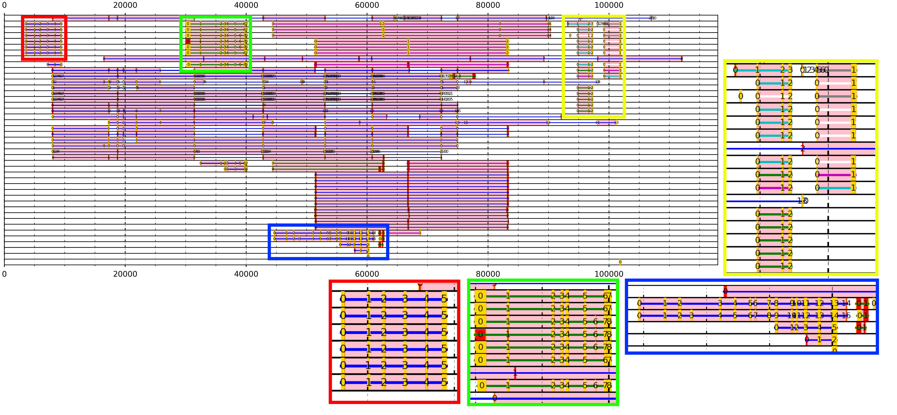
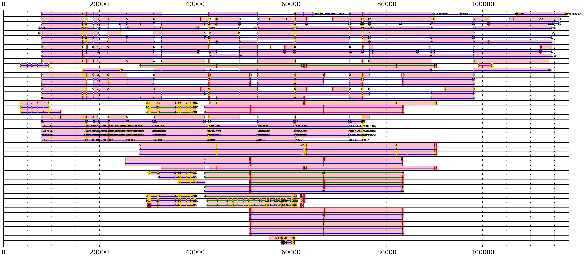
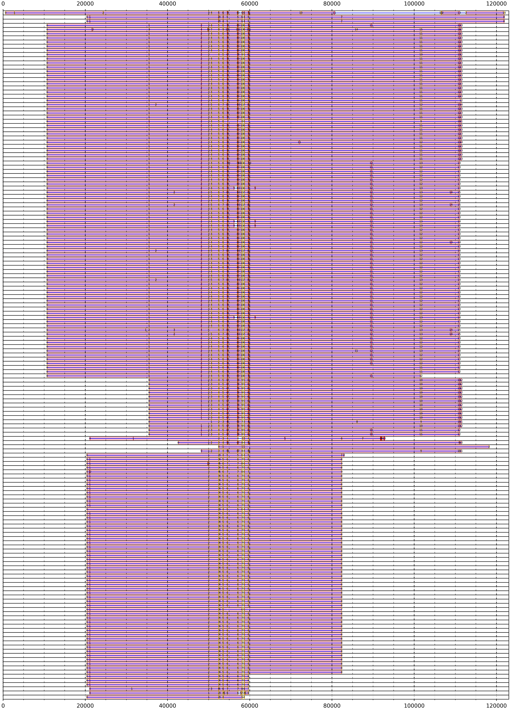
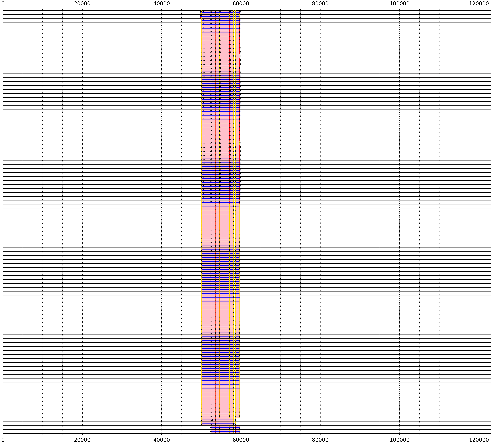

## Light filtering/pre-processing:

BAC Ef318A10

## Without filtering/pre-processing:

BAC Ef91F03

BAC Ef472C1

## Word_size 4, e-value 1, high permissiveness for alignment for finding short exons:

High permissiveness has the benefit of detecting short and variable exons, such as the exons 1 and 2 of wMT2 on the Lr6F14 BAC. The trouble is that high permissiveness causes many unspecific alignments, which reflect themselves in large transcript regions with many alignments that are outside of the largest ORF (red alignments).

BAC Lr6F14 and wMT transcripts, no filter:

BAC Lr6F14 and wMT transcripts, 5kb intron filter (filters too much when applied with high permissiveness parameters, filters out too many legitimate, complete transcript alignments):

BAC Lr6F14 and wMT transcripts, 20% coverage filter (incomplete alignments, where not every legitimate exon was detected, have been filtered, however, we are left with many unspecific alignments, but the exons have been predicted correctly):

BAC Lr6F14 and wMT transcripts, 20 coverage and 10000 intron filter:
NO RESULT, TOO MUCH FILTERED.

BAC Lr6F14 and wMT transcripts, initial 0.1 evalue, 20 coverage, and 5000 intron filter:

Perfect. Here we've managed to filter out the unspecific alignments whilst retaining our exon alignments.
