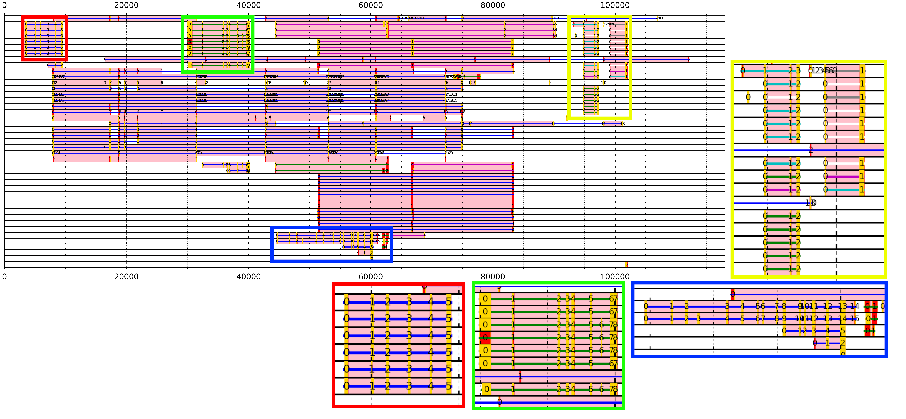

# Overview
LrRNAseq TAST processes BLAST alignments of full length long read RNAseq transcripts to a relatively short genomic region (e.g. 100kb) and facilitates recognition of gene splicing.

The **lrRNAseq_TAST_visualiser.ipynb** is the main notebook used for visualisation of collective BLAST alignments (total alignment). The notebook contains detailed instructions of use within.

The **bioinformatic_functions.ipynb** is required to be imported in the main file to call multiple functions from.

The rest of the files serve as example data to try out.

# Requirements
- Jupyter Notebook or Jupyter Lab
- Python libraries: Pandas, Matplotlib, Numpy, Regex, Biopython, OS, ast, operator
- seqtk installed via bioconda i.e. conda install bioconda::seqtk
- BLAST, outputting in -outfmt '6 qseqid sseqid slen qlen qstart qend sstart send length mismatch gapopen pident evalue bitscore' format.

[Full documentation](Docs/overview.md)

 
